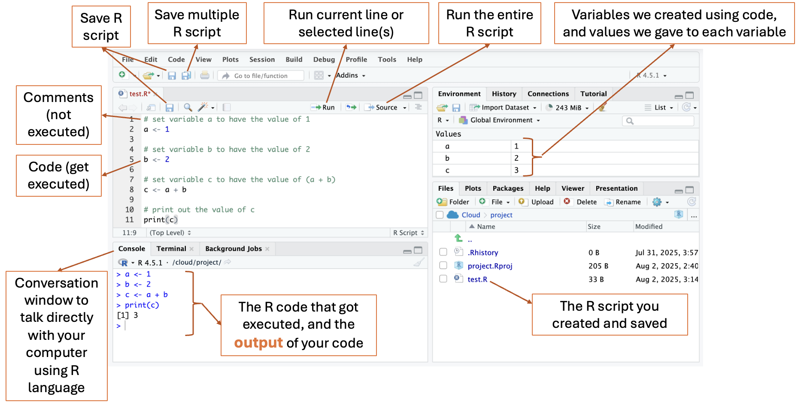

# 💻 Local R Studio Setup Guide

*For offline adventures or advanced users who want R installed on their computer*

## 🌟 When to Use Local Setup

Choose local installation if:
- 🏠 You want to code without internet
- 🚀 You're planning to continue R programming after camp
- 💻 Your family prefers local software installations
- 🔧 You're comfortable with software installation

**Note:** We recommend [Posit Cloud](posit-cloud-setup.md) for most campers as it's easier to set up!

## 📋 Step-by-Step Installation

### Step 1: Install R

1. 🌐 Go to [https://cran.r-project.org/](https://cran.r-project.org/)
2. 🖱️ Click on your operating system:
   - **Windows**: "Download R for Windows" → "base" → "Download R-4.x.x"
   - **Mac**: "Download R for macOS" → Download R based on your Mac type (newer Mac produced after 2000 uses Apple silicon (M1,2,..) chip, so select `R-4.x.x-arm64.pkg`. Older Mac uses Intel chip, so select `R-4.x.x-x86_64.pkg`)
   - **Linux**: "Download R for Linux" → Choose your distribution
3. 📥 Download and run the installer
4. ✅ Follow the installation wizard (accept default settings)

### Step 2: Install RStudio

1. 🌐 Go to [https://posit.co/download/rstudio-desktop/](https://posit.co/download/rstudio-desktop/)
2. 📥 On your right hand side, click **"Download RStudio Desktop"** (FREE version)
3. 📦 Install RStudio (it will automatically find your R installation)
4. 🚀 Launch RStudio

### Step 3: Test Your Installation

1. 🖥️ Open RStudio
2. 💬 In the Console (bottom left), type: 
```
print("Hello, magical data world!")
```
3. ⏎ Press Enter
4. 🎉 You should see your message appear!

### Step 4: Install Required Packages

Copy and paste this code into the Console:

```r
# Install packages for our camp
install.packages(c(
  "ggplot2",      # Beautiful graphs
  "dplyr",        # Data wrangling
  "gridExtra"     # Visualization grid
  "knitr",        # Document creation
  "rmarkdown"     # Reports and presentations
))
```

This might take 5-10 minutes to download and install.

## 🎯 RStudio Interface Guide

### The Four Panels

- **📝 Editor (top left):** Your magical scroll for writing longer R spells (code).
- **🔮 Console (bottom left):** Cast spells (code) here and see the magic happen instantly!
- **🌳 Environment (top right):** All the magical creatures (variables, data) you create will live here.
- **🗺️ Files & Plots (bottom right):** Find your project files and see the beautiful plots/graphs you create.




## 🆘 Troubleshooting

### "R won't install"
- ✅ Make sure you have administrator permissions
- ✅ Close all other programs during installation
- ✅ Try downloading again (file might be corrupted)
- ✅ Ask a parent/guardian for help with permissions

### "RStudio can't find R"
- ✅ Install R first, then RStudio
- ✅ Make sure both are the same "bit version" (32-bit or 64-bit)
- ✅ Restart your computer after installing R

### "Packages won't install"
- ✅ Check your internet connection
- ✅ Try installing one package at a time
- ✅ Ask your instructor for help

### "I'm getting error messages"
- ✅ Don't panic, errors are how we learn
- ✅ Read the error message carefully
- ✅ Check for typos (R is case-sensitive)
- ✅ Ask Claude AI or your instructor for help

## 🔄 Switching Between Local and Cloud

Good news! You can use both:

- 💻 **Local RStudio** for home practice and offline work
- ☁️ **Posit Cloud** for camp activities and collaboration
- 📤 **Export projects** from cloud to local when camp ends
- 📥 **Import projects** from local to cloud if needed

